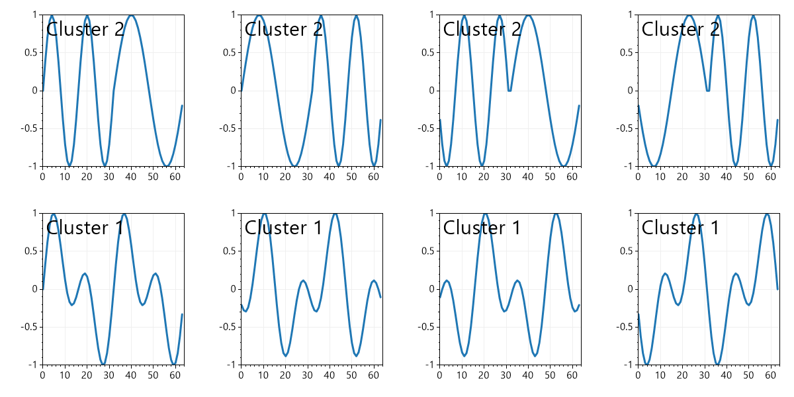
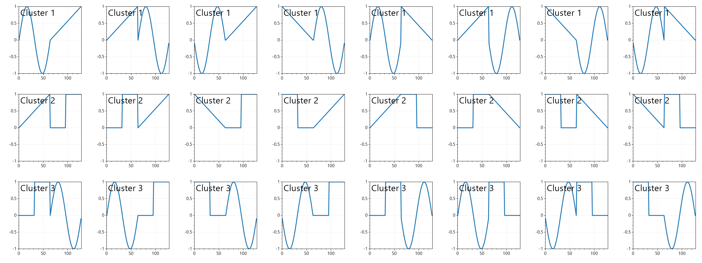

# HaarFeaturization - *O(n)* wavelet-based time series featurization

HaarFeaturization (HF) is a bespoke algorithm for converting time series into features, that is, metrics appropriate for machine learning algorithms (e.g., [ML.NET](https://dotnet.microsoft.com/en-us/apps/machinelearning-ai/ml-dotnet)). This repo hosts a proof of concept implementation of HF along with a number of demos. 

## Contents

- [Introduction](#introduction)

- [Demos and use cases](#demos-and-use-cases)

- [How it works](#how-it-works)

## Introduction

Main properties of HF are as follows:

1) **HF complexity is linear in both time and memory** HF is based on the combination of [Haar Transform](https://en.wikipedia.org/wiki/Haar_wavelet) and basic statistical computations. As all of the underlying algorithms are *O(n)* in both time and memory, HF is too.

2) **HF entails dimensionality reduction** Due to hierarchical nature of Haar Transform, HF converts a time series of length *n* into *O(log(n))* features. 

3) **HF may discern stationary and non-stationary time series** For instance, all of the time series in the picture below have the same frequency content, but differ in temporal organization. A combination of HF and k-means clustering correctly separates the time series into two clusters: non-stationary (top row) and stationary (bottom row).

4) **HF is phase-agnostic** Although HF is aware of both frequency and phase content of the time series, the algorithm is not sensitive to the phase shifts in the time series.

## Demos and use cases

### Demo 1: clustering of synthetic time series  

Folder *Demo1_SyntheticSignalsClustering* hosts the source code necessary to generate the pictures shown in the [introduction](#introduction) as well as some other simple examples. 

### Demo 2, HF for unsupervised learning: clustering of a bird song recording

In folder *Demo2_BirdSongClustering*, HF is used to split a field recording of a bird song into two clusters: one with audible bird song and one with background sounds, as shown in the picture below. 

The picture above is generated as follows:

1) [A bird song recording](https://xeno-canto.org/702488) (courtesy of [xeno-canto](https://xeno-canto.org/)) is converted to mono.

2) Resulting time series is split into blocks of equal length (512 samples each in this particular case). 

3) HF is applied to each of the blocks.

4) [K-means clustering](https://learn.microsoft.com/en-us/dotnet/machine-learning/tutorials/iris-clustering) is used to split the blocks into two clusters.

5) The cluster with higher average amplitude is marked in blue in the picture above.

### Demo 3, HF for supervised learning: classification of a bird song recording

In folder *Demo3_BirdSongClassification*, a clustered bird song is used as a labeled dataset to train a binary classification model. The model is then used to detect the song of the bird of similar species in a different audio recording. Specific workflow is as follows:

* **Preparation of the training dataset.**

    1) A number of [Elegant Pitta](https://en.wikipedia.org/wiki/Elegant_pitta) song recordings (namely, [1](https://xeno-canto.org/161623), [2](https://xeno-canto.org/166727), and [3](https://xeno-canto.org/166730); all curtesy of [xeno-canto](https://xeno-canto.org/)) are converted to mono.

    2) Resulting time series are split into blocks of equal length (256 samples each in this case).

    3) An unlabeled training dataset is generated by applying HF to each of the blocks.

    4) [K-means clustering](https://learn.microsoft.com/en-us/dotnet/machine-learning/tutorials/iris-clustering) is used to split the blocks into two clusters.

    5) A labeled training dataset is created by combining the unlabeled dataset from step 3 with the cluster labels. An example of the labeled training dataset is shown below. Note how k-means clustering isolated a particular part of the Elegant Pitta's call:

    

* **Training and employment of a binary classification model.**

    6) [Logistic regression](https://learn.microsoft.com/en-us/dotnet/machine-learning/tutorials/sentiment-analysis) model is trained using the labeled dataset.

    7) A number of *new* [Elegant Pitta](https://en.wikipedia.org/wiki/Elegant_pitta) song recordings (namely, [1](https://xeno-canto.org/161619) and [2](https://xeno-canto.org/166730); all curtesy of [xeno-canto](https://xeno-canto.org/)) are converted to mono.

    8) Resulting time series are split into blocks of equal length (256 samples each in this case).

    9) An unlabeled test dataset is generated by applying HF to each of the blocks.

    10) Finally, logistic regression model from step 6 is used to label the test dataset. An example of the classified test dataset is shown below. As expected, logistic regression identified a part of the Elegant Pitta's call that is similar to the clustering result in the picture above (listen to the recordings to compare some [train](https://xeno-canto.org/166727) and [test](https://xeno-canto.org/161619) data):

    

## How it works

### General HF algorithm

The core part of the HF algorithm is located in *HaarFeaturization/HaarFeaturization.cs* and *HaarFeaturization/DefaultFeaturizer.cs*. In essence, for any given time series, HF performs the following steps: 

1) Use [Haar Transform](https://en.wikipedia.org/wiki/Haar_wavelet) to compute the Haar Image of the time series.

2) For each of the scales of the Haar Image, compute a number of statistical metrics. This proof of concept uses [mean value](https://en.wikipedia.org/wiki/Mean), [standard deviation](https://en.wikipedia.org/wiki/Standard_deviation), [skewness](https://en.wikipedia.org/wiki/Skewness), and [kurtosis](https://en.wikipedia.org/wiki/Kurtosis).

3) Normalize each of the statistical metrics across the Haar spectrum.

### HF parameters

This implementation of HF has three main parameters: **Block size**, **ScalesToDrop**, and **HigherMomentsThreshold**.

**Block size** is used when a longer time series is split into chunks for [clustering](#demo-2-hf-for-unsupervised-learning-clustering-of-a-bird-song-recording) or [classification](#demo-3-hf-for-supervised-learning-classification-of-a-bird-song-recording). As the name implies, block size determines the size of a chunk to apply HF to. Since HF relies on a number of statistical metrics, the blocks should as [homoskedastic](https://en.wikipedia.org/wiki/Homoscedasticity_and_heteroscedasticity) as possible for HF to be useful. Accordingly, the demos in this repo employ rather small blocks of 256 and 512 samples.

**ScalesToDrop** corresponds to the scales of the Haar image to be excluded from consideration. This parameter is useful to filter out noisy frequency bands. For example, below is [a Chopi Blackbird song](https://xeno-canto.org/702488) clustered using the algorithm from the [Demo 2](#demo-2-hf-for-unsupervised-learning-clustering-of-a-bird-song-recording):

In contrast, Below is the same song clustered using the same algorithm, while disregarding the lowest scale (that is, without the highest frequency band):

**HigherMomentsThreshold** indicates the minimal scale length for which [skewness](https://en.wikipedia.org/wiki/Skewness) and [kurtosis](https://en.wikipedia.org/wiki/Kurtosis) should be computed. As both skewness and kurtosis represent higher moments of the probability distribution, their values are sensitive for small sample sizes. Accordingly, the demos in this repo that involve real-world time series employ HigherMomentsThreshold == 32.

### Quirks and outlook

1) [Haar Transform](https://en.wikipedia.org/wiki/Haar_wavelet) is usually defined in such a way that its spectrum matches Fourier power spectrum (i.e., regardless of frequency, oscillations of *equal energy* yield peaks of equal height on the spectrum). In contrast, this implementation of HF uses a different weighing, such that oscillations of *equal amplitudes* yield equal Haar coefficients regardless of their frequency. Effect of this choice remains to be investigated.

2) On paper, HF should not require the time series in the dataset to have the same length. In reality, statistical metrics used in HF are sensitive to these differences and so is HF.

3) It would be interesting to explore alternative ways to convert Haar images into features. In particular, the once that may handle heteroskedastic time series.
